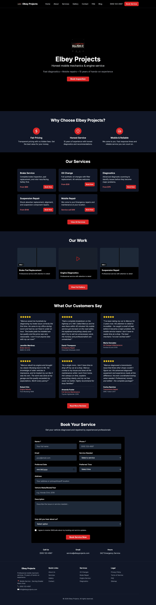
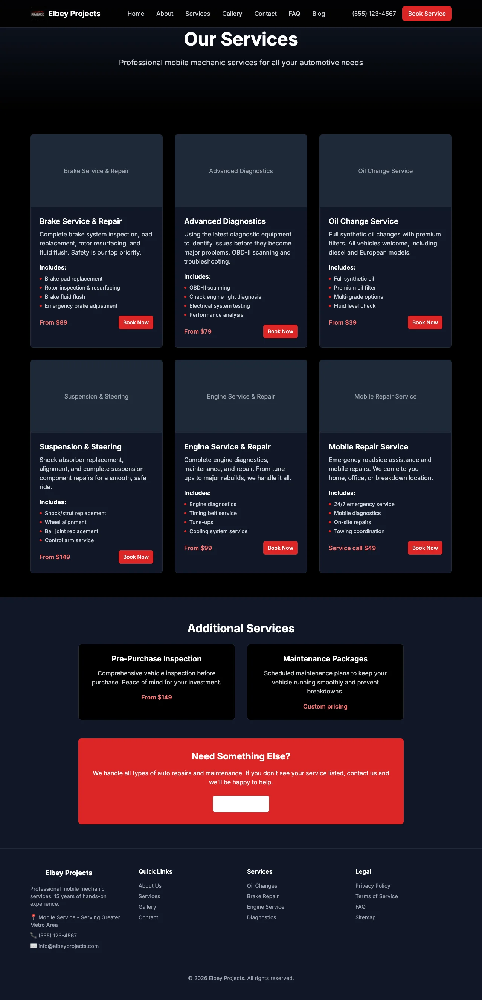
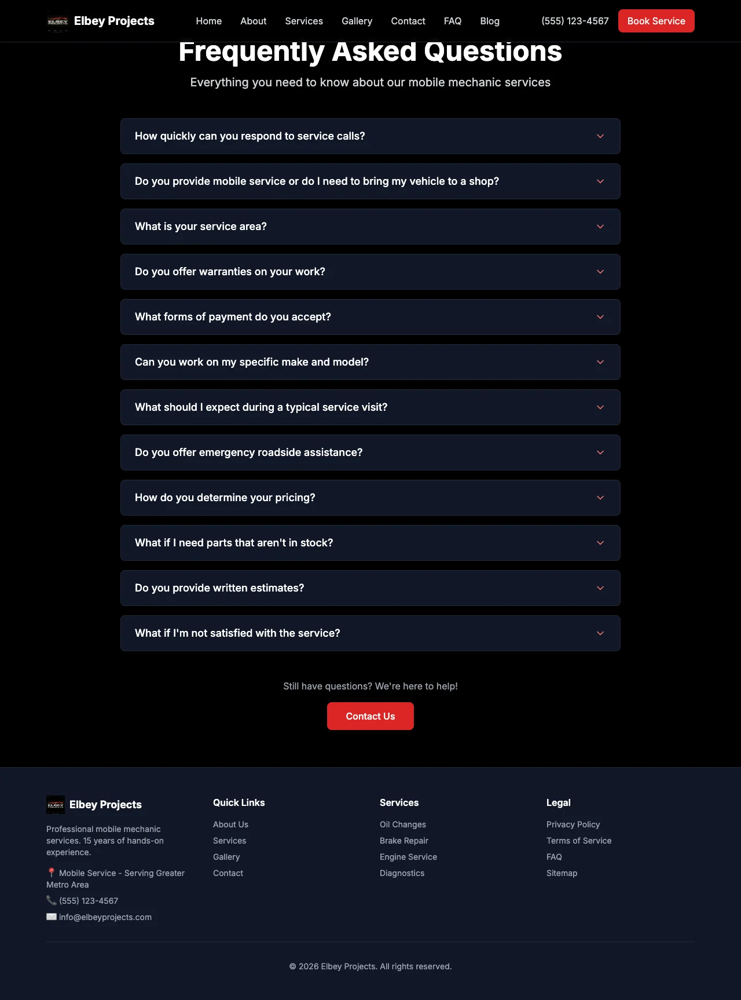

# Elbey Projects Website (`marcus-website`)

Canonical repository for the Elbey Projects customer website.

This project is a multi-page, mobile-first marketing site built to convert local service traffic into bookings.

## What this project delivers

- Clear service presentation and trust signals
- Mobile-first navigation and conversion-focused CTAs
- Gallery, FAQ, blog, and legal pages
- SEO-ready site structure and deployment configuration

## Screenshots





## Stack

- Next.js
- TypeScript
- Tailwind CSS
- Vercel deployment

## Quickstart

```bash
npm install
npm run dev
```

## Quality commands

```bash
npm run build
npm run typecheck
npm run lint
```

## Docs

- [Architecture](docs/architecture.md)
- [Setup](docs/setup.md)
- [Impact](docs/impact.md)

## Contact

- Email: fuaadabdullah@gmail.com
- LinkedIn: https://www.linkedin.com/in/fuaadabdullah
